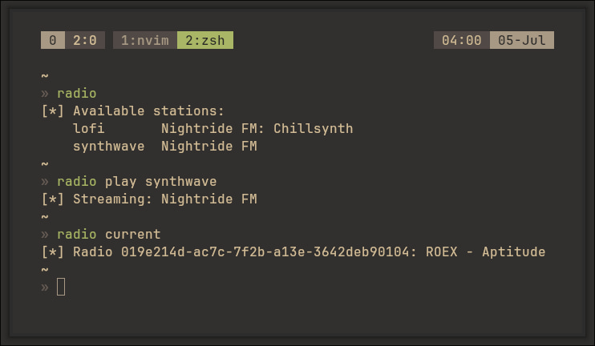

# radio-cli



Minimalist CLI for streaming internet radio stations via MPD (Music Player Daemon).

## Table of Contents
* [Features](#features)
* [Requirements](#requirements)
* [Installation & Setup](#installation--setup)
* [Quick Start](#quick-start)
* [Usage](#usage)
* [File Layout](#file-layout)
* [Troubleshooting](#troubleshooting)
* [Acknowledgments](#acknowledgments)
* [Disclaimer](#disclaimer)
* [License](#license)

## Features
* Stream internet radio stations directly through MPD.
* Built-in stations: Nightride FM (synthwave) and Nightride FM Chillsynth (lofi).
* Zero external Python dependencies — pure `subprocess` and `mpc`.
* Lightweight CLI with stop, pause, toggle, and current-track commands.

## Requirements
* Linux with `systemd` (the daemon commands use `systemctl --user`)
* `uv` (Fast Python package and project manager)
* `mpd` & `mpc`

The script runs as a standalone PEP 723 inline script — no manual `pip install` required.

> **Note:** this project lives in `~/.config/scripts/radio/`. Follow the clone step below exactly.

## Installation & Setup

### 1. Install uv

Ensure `uv` is installed on your system (e.g., `yay -S uv` on Arch Linux).

### 2. Clone the repository

```bash
mkdir -p ~/.config/scripts && cd $_
git clone https://github.com/diominvd/radio-cli.git radio
cd radio
```

### 3. Configure the MPD socket

MPD must expose a UNIX socket. Create its directory and add the socket to
`~/.config/mpd/mpd.conf`:

```bash
mkdir -p ~/.local/share/mpd
```

```
# ~/.config/mpd/mpd.conf
bind_to_address "~/.local/share/mpd/socket"
```

To make `mpc` aware of this socket, export `MPD_HOST` in your shell
configuration file (e.g., `~/.zshrc` or `~/.zshenv`):

```
export MPD_HOST="$HOME/.local/share/mpd/socket"
```

If your socket lives elsewhere, update both files accordingly.

### 4. Create the `radio` command

Make `radio.py` executable and expose it as `radio` via a symlink **or** an alias.

```bash
chmod +x radio.py
```

**Option A — symlink into a directory on your `PATH`:**

```bash
mkdir -p ~/.local/bin
ln -s ~/.config/scripts/radio/radio.py ~/.local/bin/radio
# ensure ~/.local/bin is on your PATH
```

**Option B — shell alias:**

```bash
echo 'alias radio="~/.config/scripts/radio/radio.py"' >> ~/.zshrc
source ~/.zshrc
```

## Quick Start

After setup, start playback with:

```bash
radio --start    # start the MPD user service
radio --play lofi    # or: radio --play synthwave
```

## Usage

```bash
radio [ COMMAND ]
```

### Daemon
| Command | Description |
| --- | --- |
| `--start` | Start the MPD user service. |
| `--stop` | Stop the MPD user service. |
| `--restart` | Restart the MPD user service. |
| `--status` | Show the MPD service status. |

### Playback
| Command | Description |
| --- | --- |
| `--play <station>` | Start streaming the given station (lofi, synthwave). |
| `--stop` | Stop playback and clear the queue. |
| `--pause` | Pause playback. |
| `--toggle` | Toggle play/pause. |
| `--current` | Print the currently playing track. |

### Stations
| Command | Description |
| --- | --- |
| `--list` | List all available stations. |

## File Layout

All state lives under `~/.config/scripts/radio/`.

```
~/.config/scripts/radio/
└── radio.py
```

| Path | Description |
| --- | --- |
| `radio.py` | CLI entry point, station definitions, and MPD command router. |

## Troubleshooting

| Problem | Solution |
| --- | --- |
| `--start` does nothing | Make sure an MPD user service exists and is enabled (`systemctl --user status mpd`). |
| `mpc` can't connect | Verify `MPD_HOST` points to the same socket configured in `mpd.conf`. |
| Stream won't play | MPD needs a working internet connection and `mpc` must be installed. |
| `radio: command not found` | Confirm `~/.local/bin` is on your `PATH`, or reload your shell after adding the alias. |

## Acknowledgments

* [Nightride FM](https://nightride.fm/) — the featured synthwave and chillsynth streams.
* [MPD](https://www.musicpd.org/) — the playback backend.
* [uv](https://github.com/astral-sh/uv) — fast Python package and project manager.

## Disclaimer

This is an unofficial tool and is not affiliated with, authorized, or endorsed by
Nightride FM. It relies on their public streaming URLs — use it at your own risk.

## License

This project is licensed under the MIT License — see the [LICENSE](LICENSE) file for details.
